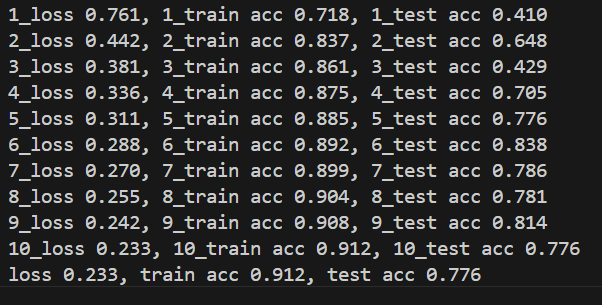
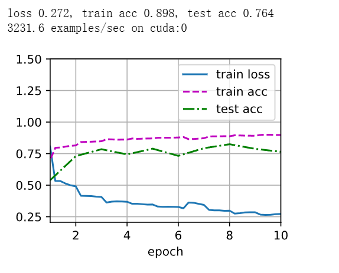

# 相关包版本
Python                    3.9.18  
d2l                       0.17.6  
matplotlib                3.5.1  
torch                     2.4.0+cu121  
torchvision               0.19.0+cu121  

# 数据集
torchvision.datasets.FashionMNIST

# 测试结果

# 相关总结和经验
出现了过拟合，尝试了dropout，但反而在不提高train_acc的情况下，大幅降低了train_acc。
  
尝试过将最后的CNN更换为残差网络，但结果并不好。  

最初使用enisum进行注意力计算，但反向传播时间过长。  

结果比不上用resnet，但训练效率较高。